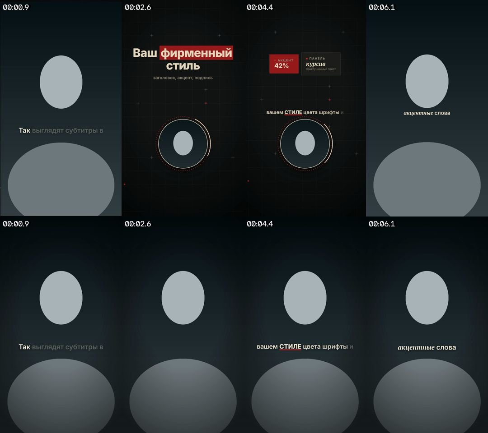
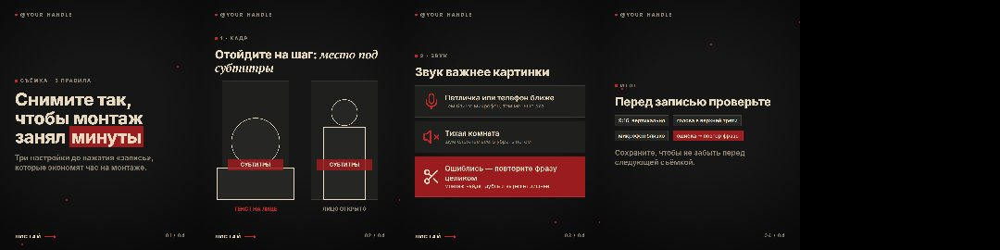

# Монтаж коротких видео и карусели с Claude

Снимаете себя на телефон - Claude монтирует вертикальный ролик для Reels, Shorts и TikTok: вырезает оговорки, дубли и паузы, добавляет субтитры и, если нужно, графику в вашем фирменном стиле. Он же делает карусели для Instagram и Threads. Программировать не нужно: вы пишете Claude обычными словами.

## Что умеет
- **Монтаж видео** - три шаблона:
  - **visuals** - спикер в кружке, над ним графика, придуманная под содержание ролика;
  - **simple** - видео на весь экран и субтитры;
  - **alternate** - вы на весь экран и графика на весь кадр сменяют друг друга каждые 3-7 секунд.

  Подробнее: [docs/05-templates.md](docs/05-templates.md).
- **Карусели** - слайды со схемами в том же стиле и подпись к посту.
- **Свой стиль** - цвета, шрифты и ник под ваш бренд: Claude спросит, что вам нравится, и покажет, как это выглядит.

Вся обработка видео идёт на вашем компьютере; в Claude уходят только текст расшифровки и несколько кадров для проверки.

## Что нужно
- Компьютер с **Windows 10/11** (через WSL, это встроенный в Windows Linux) или **macOS**; от 8 ГБ памяти и 10 ГБ свободного места.
- **Claude Code** с подпиской Claude (Pro или Max). Установщик поставит Claude Code сам, войти в аккаунт нужно будет при первом запуске.

## Быстрый старт
1. Установка - по шагам в [docs/01-install.md](docs/01-install.md) (один раз, 20-40 минут, почти всё само).
2. В папке проекта запустите `claude` и напишите: **«смонтируй видео videos/мое-видео.mp4»**.
3. Хотите свой стиль - напишите **«давай настроим мой стиль»**.

## Что можно писать Claude
- «Смонтируй `C:\Users\Анна\Videos\запись.mp4` в шаблоне simple»
- «Убери кусок, где я сбилась на 0:15, и сделай графику крупнее»
- «Сделай карусель из этого видео»
- «Карусель: 5 ошибок новичков в продажах, моя мысль - ...»
- «Поменяй акцентный цвет на синий, как на моём логотипе»
- «Что-то не работает» - Claude сам проверит установку

## Инструкции
1. [Установка](docs/01-install.md)
2. [Монтаж видео](docs/02-video.md)
3. [Карусели](docs/03-carousels.md)
4. [Свой стиль](docs/04-style.md)
5. [Шаблоны видео](docs/05-templates.md)
6. [Если что-то не работает и как всё удалить](docs/06-problems.md)
